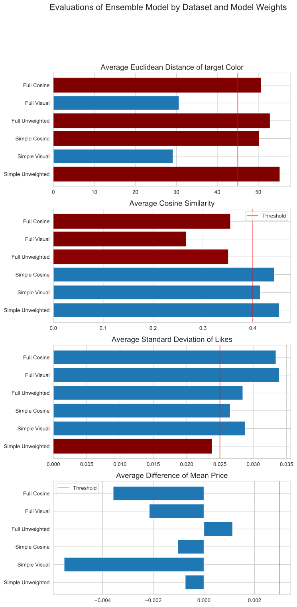

# Visual Clothing Recommender
created by Nick Subic
bagnine@gmail.com

## The Business Problem

Since the onset of the COVID-19 pandemic, online shopping has increased quarter over quarter by over 30%. While many retailers have completely re-designed their platforms to optimize for the trend in online sales, seller to seller markets for the most part remain unchanged. 

In sites like eBay, ThredUp and Etsy, there are millions of listings in every clothing category which are only searchable using keywords and filters. Because sellers take advantage of these systems to redirect traffic, I'm developing a model that uses image data to make large, disorganized data searchable using visual features.

Here are a few ways that this platform could benefit the buyer, seller and host:

* Buyers can use one listing to search for identical items at lower prices or in different sizes
* Images from social media or music videos could be input into search engines to reproduce looks
* Users could take photos of their existing wardrobe and search for items in different categories that match specific colors
* International sellers could easily market items without being hindered by language barriers
* Host sites can create sleek, visual interfaces to make the experience on their site more closely mimic in-person shopping

## Data

I used Selenium Webdriver to scroll through the main page of grailed.com over 200 times, generating 40+ new entries with each scroll. I filtered the main page for tops- shirts, hoodies, sweaters and sweatshirts. I then scraped the summary information from each listing as well as the URL of each listing's page, all of which was condensed into a data set.

Next, I created a function to navigate to each URL in my data set's Link column. I scraped more in-depth information including seller info, location, likes, price, and the seller's description. I also downloaded the first image on each page. This information was condensed into a second data set.

Finally, I removed the backgrounds from each image and isolated the item in them. I used the ColorThief library to extract the 3 most dominant colors from each image and stored them in a 3 column data set of RGB tuples. 

Here, you can see that the background of the image is the most dominant color in the palette

After removing the background, the dominant colors remain and black is easily removed


All three data sets were then joined by index to create one data set with 67 columns and 10,000 rows.

## Methods

After cleaning my data, I created a series of functions which used the color tuples to visually inspect the data based on Euclidean distance. My objectives were to verify that my background removal function had been effective, that I had successfully filtered the black from the now missing background, and that the remaining colors could be used to return visually similar items.

I chose to use some of the same images as in the image_process notebook in order to see how successful my removal of backgrounds was as well as the general similarliy of the items.


Subsequent tests showed that the dominant colors were very easily matched up in items that were mostly one or two colors.


However, in items with a lot of colors, the similarities tend to break down a bit. In future iterations I may expand the number of colors to pull from each palette in order to better categorize images like this one.


Finally, in this plot you can see that the filter was able to find a different listing for a very similar item, potentially offering the buyer a lower-priced alternative of the first listing. This is an early sign that I've achieved one of my project's goals.


I analyzed the descriptions of each item using SciKit Learn's TF-IDF Vectorizer and generated features using the top 100 words it returned. 

I also split sizing and designer data into bins and created features for each of them. 

## Modeling 

I created four basic recommender models. The first one, as shown above, uses Euclidean distance to recommend items with the most similar color palette to the target. 

The next 3 models used clustering, cosine similarity and K Nearest Neighbors to select items based on 2 different data sets- the full set of features, including seller data, location and NLP features engineered from the item descriptions, and a stripped down version that relies only on categories a user could reasonably input.

The purpose of the split data sets was to simulate a recommender happening behind the scenes as a user browses a site without inputting any filtering data versus a smaller set of features relying only on user input.

## Evaluation Metrics

Item to Item recommendation systems are difficult to evaluate without user sentiment, but in the interest of improving my results before even a limited deployment, I created a handful of metrics and set thresholds for each iteration's performance.

* Visual similarity to the target, from both quantitative analysis and visual inspection
* Price similarity to target, measured by mean difference in price with recommendations
* Standard deviation of likes as a means to combat the long tail problem- ideally the recommended items would have a deviation that matches the full data set.
* Cosine similarity, as a means to guage the similarity across features like size, vintage, etc.

After testing the above models, I created an ensemble recommender which ran all four of the functions I created and returns recommendations based on frequency from each of them. I also created a few weight standards to choose from in testing the models in order to focus more on visual features or overall similarity.

Finally, I designed a function to randomly select target rows from my data, generate recommendations from them, and aggregate the metrics in order to validate my models' performances.

## Results

The chart below shows the evaluation metrics of six combinations of data and model weighting- 

A simple data set without weights, weighted for visual similarity and weighted for cosine similarity, and a more complex 'Full' data set with the same 3 iterations. 



My models performed relatively well across the two datasets and 3 model weight parameters, but without user testing, there is a limit to how much can be concluded from these metrics alone. 

For implementation, I would suggest a few different use cases.

The simple data set was created to simulate a situation where limited user input was used to generate recommendations. With only 9 features (plus the 3 color features) it performed nearly as well as the larger data set across the board. The cosine similarity scores are all higher, but there needs to be a handicap for the larger model as the number of features lowers its score automatically. 

By using the two different model weights, users could input their size, price range, a target image or color palette of their choosing and whether or not they were looking for a vintage item, and receive a relatively good prediction. For shoppers who are looking for a similar listing to one that was not in their size or out of their budget range, the visual recommender would do well. For shoppers looking for a similar item to one they already owned or liked in the same size or price range, the cosine weighted model would return a better prediction.

The full data set is optimized for recommendations based on user behavior, but without rating or purchase data. It could be used to recommend similar listings to those a user had already viewed using the full data of each listing. Which weight would be more effective could only be determined through user testing.

## Next Steps

My immediate next steps with this model will be to implement a user trial by asking a group to select an image of a piece of clothing they like or want to buy along with size and price information and generating recommendations from this dataset for them to rate.

I've created a GUI using Streamlit in order to facilitate user evaluation. Its current iteration is capable of making recommendations from the dataset using user inputs of size, price, vintage and a selection of three colors. 

As I continue to devleop the GUI, I'd like to add a function that takes in an uploaded image, extracts the color features from it and makes recommendations when combined with user input. 

I would also create a feature that allows multiple types of items (shoes, pants, glasses, etc.) with the hope of ultimately creating a function that could curate an entire outfit or wardrobe. Incorporating deep learning would be an exciting aspect at this step- by classifying an image with a CNN, similar items across categories and even outside of apparel could be recommended.

## Acknowledgements

Sections of code from the web scraping portion of this project were modified from [Scraping Grailed](https://medium.com/@mike_liu/scraping-grailed-8501eef914a8)

The removal of image backgrounds using OpenCV was modified from Chris Albon's tutorial [here](https://chrisalbon.com/machine_learning/preprocessing_images/remove_backgrounds/)

I referenced several websites to learn about evaluation metrics in item-to-item recommendation systems, including [Evaluating Recommendation Systems](https://medium.com/fnplus/evaluating-recommender-systems-with-python-code-ae0c370c90be)

## Repository Structure

```
├── clothing_recommender.ipynb                The main notebook detailing summary of EDA, modeling and results
├── README.md                                 The README for this project                                 
├── notebooks                                 Data scraping, modeling and exploratory notebooks
│   ├── image_process
│   ├── data_import
│   ├── EDA
│   └── model
└── src
    ├── data                                  Web scraped and engineered data
    ├── modules                               Functions used in this repository's notebooks
    └── readme_img                            README source images
```