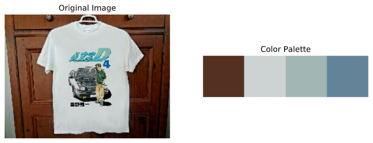
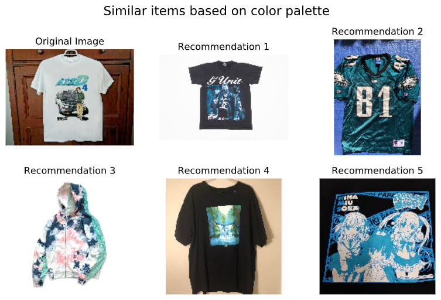
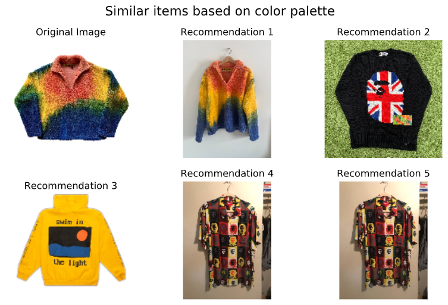

# Visual Clothing Recommender
created by Nick Subic
bagnine@gmail.com

## The Business Problem

Since the onset of the COVID-19 pandemic, online shopping has increased quarter over quarter by over 30%. While many retail platforms have completely re-designed their platforms to optimize for the trend in online sales, seller to seller markets for the most part remain unchanged. 

For consumers who are trying to avoid fast fashion, or who want to shop based on item appearance rather than brand, sites like eBay, Etsy, Grailed, thredup and many others offer significant challenges. Because these sites rely on seller input to catalogue and organize their data, most items contain the same keywords designed to direct traffic. The massive number of listings can result in endless scrolling and hundreds of identical entries, leading to fatigue on the client's part. 

On the seller's side, it may be extremely difficult to market unique vintage products that would easily sell at an in-person market but don't fit conventional search criteria. 

Finally, for the host sites themselves, a more easily navigated interface could boost confidence in their brand and direct more traffic, sales and ad revenue. 

For this project, my proposed solution to the problems above is to create a platform capable of analyzing image data and recommending clothing based on color and appearance as well as conventional criteria like size or price. Here are a few ways that this platform could benefit the buyer, seller and host:

* Buyers can use one listing to search for identical items at lower prices or in different sizes
* Images from social media or music videos could be input into search engines to return similar results
* Users could take photos of their existing wardrobe and search for items in different categories that match specific colors
* International sellers could easily market items without being hindered by language barriers
* Host sites can create sleek, visual interfaces to make the experience on their site more closely mimic in-person shopping

## Data

I used Selenium Webdriver to scroll through the main page of grailed.com over 200 times, generating 40+ new entries with each scroll. I filtered the main page for tops- shirts, hoodies, sweaters and sweatshirts. I then scraped the summary information from each listing as well as the URL of each listing's page, all of which was condensed into a DataFrame.

Next, I created a function to navigate to each URL in my DataFrame's Link column. I scraped more in-depth information including seller info, location, likes, price, and the seller's description. I also downloaded the first image on each page. This information was condensed into a second DataFrame.

Finally, I removed the backgrounds from each image and isolated the item in them. I used the ColorThief library to extract the 3 most dominant colors from each image and stored them in a 3 column DataFrame of RGB tuples. 

Here, you can see that the background of the image is the most dominant color in the palette

After removing the background, the dominant colors remain and black is easily removed

All three DataFrames were then joined by index to create one data set with 67 columns and 10,000 rows.

## Methods

After cleaning my data, I created a series of functions which used the color tuples to visually inspect the data based on Euclidean distance. My objectives were to verify that my background removal function had been effective, that I had successfully filtered the black from the now missing background, and that the remaining colors could be used to return visually similar items.

I chose to use some of the same images as in the image_process notebook in order to see how successful my removal of backgrounds was as well as the general similarliy of the items.

Subsequent tests showed that the dominant colors were very easily matched up in items that were mostly one or two colors.

However, in items with a lot of colors, the similarities tend to break down a bit. In future iterations I may expand the number of colors to pull from each palette in order to better categorize images like this one.

Finally, in this plot you can see that the filter was able to find a different listing for a very similar item, potentially offering the buyer a lower-priced alternative of the first listing. This is an early sign that I've achieved one of my project's goals.

(NLP, tfidf, PCA, visualizations)

## Modeling 

(cosine similarity, standard deviation of likes, support vector clustering, k-means)

## Results

## Next Steps

(GUI, expanded dataset, )

## Acknowledgements

Sections of code from the web scraping portion of this project were modified from (link here) 

The removal of image backgrounds using OpenCV was modified from Chris Albon's tutorial here (link)

## Repo Structure